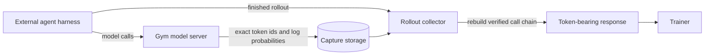

# Training on External Agent Harnesses

An external agent harness runs its own model-calling loop and returns a finished transcript to Gym. Claude Code is one example. The transcript contains the conversation text, but it does not contain the exact token ids and log probabilities produced by each model call.

Training needs those original token ids. Re-tokenizing the final text can produce a different sequence from the one sampled by the policy. Gym's training-token capture records the ids while they are still available in the model server, associates the calls with their rollout, and rebuilds them into the token-bearing response expected by the trainer.

## Decide whether you need token capture

| Agent behavior | What to do |
|---|---|
| The agent returns Responses API output items that already contain generated token ids. | Train on the returned response. Gym preserves these native token ids. |
| The agent drives its own model calls and returns only text or a wire format without token ids. | Enable training-token capture. |
| The agent returns token ids in a format Gym does not recognize. | Enable capture for now and open an issue describing the returned format. |

Ordinary evaluation does not require training-token capture. Enable it when the collected rollouts will be used to optimize a policy.

## How capture works



Every model call carries the rollout id. For a multi-call rollout, Gym verifies which earlier call the new request continues. After the harness finishes, Gym reads the captured calls and replaces the rollout's text-only `response.output` with output items that carry the original token ids and log probabilities.

Gym does not guess when a call is missing or its parent cannot be proven. It sets `mask_sample: true` so the trainer can exclude that rollout from the loss.

## Configure local capture

The default setup writes capture records to a node-local directory and lets Gym rebuild the response.

The YAML snippets in this section are Gym config. Put them in a file and pass it with `--config` to both `gym env start` and `gym eval run`, as shown in [Run a first rollout with Claude Code](#run-a-first-rollout-with-claude-code). When NeMo RL starts Gym, place the same keys under `env.nemo_gym` in the NeMo RL config instead.

### 1. Configure the model server for training

Use `responses_api_models/vllm_model/configs/vllm_model_for_training.yaml` as the model-server config. It enables token information in model responses.

External harnesses often omit sampling parameters or send serving-oriented defaults. Pin the parameters used by training with `sampling_overrides` so every request uses the policy's intended sampling configuration:

```yaml
policy_model:
  responses_api_models:
    vllm_model:
      return_token_id_information: true
      sampling_overrides:
        temperature: 1.0
        top_p: 1.0
        top_k: -1
```

Replace the example values with the sampling settings used by the trainer. If the training framework starts vLLM, keep its tokenizer enabled. For NeMo RL, set `policy.generation.vllm_cfg.skip_tokenizer_init: false`.

### 2. Enable the capture store

Add the run-wide capture settings:

```yaml
token_id_capture:
  enabled: true
  dir: /tmp/nemo_gym_token_id_captures
  delta_records: true
  max_mask_fraction: 0.5
```

`delta_records: true` avoids storing the growing full prompt again for every resolved continuation. Root and unresolved calls remain self-contained so Gym can diagnose a broken chain.

`max_mask_fraction` is an optional safety limit. After at least `mask_fraction_min_samples` finalized rollouts, collection stops if the masked fraction exceeds this value. Omit it to disable the limit.

`mask_incomplete_when_attributed` (default `true`) decides what happens when a model call registered its capture intent but never committed a record, which is what a harness killed at its timeout leaves behind. By default such an incomplete capture always sets `mask_sample: true`. Set it to `false` to keep the rollout when terminal attribution delivered the verifier-scored chain whole: a call with no record cannot sit inside a delivered chain, so the uncaptured call lies outside the scored trajectory. Without a delivered attribution the rollout is still masked.

### 3. Opt in the external agent

Enable capture on each external harness that returns no token ids:

```yaml
claude_code_agent:
  responses_api_agents:
    claude_code_agent:
      token_id_capture: true
```

Both the run-wide `enabled` setting and the agent opt-in are required. To capture every configured agent, set `token_id_capture.all_agents: true` instead of setting the flag on each agent.

Some harnesses probe optional model-server endpoints such as `/v1/models`. Gym does not need to implement or predict these endpoints, and no per-harness route configuration is required. An unimplemented request that returns 404 or 405 cannot contribute policy-generated text and does not make capture incomplete. Any other response from an unrecognized route fails closed because its content could enter a later prompt; the rollout is marked with `mask_sample: true`.

If a custom model server implements a successful metadata, health, or tokenization route whose response cannot contain policy-generated content, declare the exact method and path once on that model server:

```yaml
responses_api_models:
  custom_model:
    token_id_capture_non_generating_requests:
      - method: GET
        path: /custom/metadata
```

Declarations belong to the model server because the server owns the route and its response semantics. Gym rejects wildcards, query strings, non-string methods, and paths without a leading slash. Do not declare title generation, summarization, compaction, or another endpoint that can return policy-generated text. Unknown redirects, server errors, exceptions, and requests that finish without starting a response all mark the rollout incomplete.

<Note>
Native Gym agents normally leave `token_id_capture` disabled because their responses already contain the token ids needed for training.
</Note>

### 4. Enable tool calling in the inference server

A tool-call parser converts model output into structured calls that the harness can execute. Without the correct parser, an agentic rollout may stop after one model call even though capture itself is working.

vLLM needs two settings to return tool calls. The first turns on automatic tool choice. The second names the parser that matches the model's tool-call format. Setting only the parser leaves tool calling disabled.

For a standalone vLLM server, pass both flags to `vllm serve`:

```bash
vllm serve Qwen/Qwen3-4B-Thinking-2507 --enable-auto-tool-choice --tool-call-parser hermes
```

When NeMo RL starts vLLM, set both keys in its chat-serving settings:

```yaml
policy:
  generation:
    vllm_cfg:
      http_server_serving_chat_kwargs:
        enable_auto_tools: true
        tool_parser: hermes
```

Replace `hermes` with the parser that the model card recommends. Check `n_calls` on the first collected rollouts before relying on reward results.

### 5. Route model calls from a custom harness

Gym links each model call to its rollout through the URL path. A training-capture call goes to the Gym model server with this prefix in front of the usual API path:

```text
/ng-rollout/<rollout_id>/training-token-capture
```

For example, a harness that calls a chat-completions endpoint for rollout `3-0` sends its request to `http://<model-server>/ng-rollout/3-0/training-token-capture/v1/chat/completions`. The model server removes the prefix before routing the request. It records the call's token ids under rollout `3-0`.

The built-in external agents, such as Claude Code, add this prefix when `token_id_capture` is enabled for them and they call a Gym model server. A custom harness must add it to every model call. Without the `training-token-capture` segment, the call is not recorded for training, and Gym masks the rollout because it finds no captured calls.

Agents based on `SimpleResponsesAPIAgent` can build the prefixed URL with `base_url_for_run(base_url, body)` or `url_path_for_run(url_path, body)`. Both helpers read the rollout id from the run request and add the training segment when the agent has opted into capture. [Model-call capture](/main/model-server/model-call-capture#if-you-build-a-custom-agent) describes the same URL prefix for evaluation capture, along with the other routing helpers.

## Run a first rollout with Claude Code

This example collects captured rollouts from the Claude Code agent on the `reasoning_gym` example tasks. It combines the settings from the previous section into one file. Run the commands from the root of the Gym repository.

Start a vLLM server with tool calling enabled:

```bash
vllm serve Qwen/Qwen3-4B-Thinking-2507 \
    --enable-auto-tool-choice --tool-call-parser hermes \
    --reasoning-parser deepseek_r1 \
    --max-model-len 65536 \
    --host 0.0.0.0 \
    --port 10240
```

Claude Code requests up to 32,000 output tokens on every model call. vLLM rejects a request whose prompt and requested output together exceed the context length, so `--max-model-len` must leave room for both. The value `65536` does that and also fits the model's KV cache on a single 48 GB GPU.

Save the capture settings as `token_capture.yaml`:

```yaml
policy_model:
  responses_api_models:
    vllm_model:
      sampling_overrides:
        temperature: 1.0
        top_p: 1.0
        top_k: -1

token_id_capture:
  enabled: true
  dir: /tmp/nemo_gym_token_id_captures
  delta_records: true

reasoning_gym_claude_code_agent_model_server:
  responses_api_agents:
    claude_code_agent:
      token_id_capture: true
```

The last block opts in the Claude Code agent that this environment defines. That agent sends its model calls through the Gym model server named `policy_model`, which capture requires. A Claude Code agent that calls an external `anthropic_base_url` directly bypasses the Gym model server, so its calls are never captured.

In a second terminal, start the Gym servers. The `--model-type` flag selects the training config of the vLLM model server. The `--config` flag adds the capture settings on top of it:

```bash
gym env start \
    --resources-server reasoning_gym/reasoning_gym_claude_code_agent_model_server \
    --model-type vllm_model/vllm_model_for_training \
    --config token_capture.yaml \
    --model-url http://localhost:10240/v1 \
    --model Qwen/Qwen3-4B-Thinking-2507 \
    --model-api-key EMPTY
```

In a third terminal, collect rollouts against the running servers. Pass the same `--config` file again:

```bash
gym eval run --no-serve \
    --agent reasoning_gym_claude_code_agent_model_server \
    --config token_capture.yaml \
    --input resources_servers/reasoning_gym/data/example.jsonl \
    --output claude_code_capture_rollouts.jsonl \
    --limit 5
```

Print the capture result for each rollout:

```bash
jq -c '{reward, mask_sample, capture: ._ng_token_capture | {n_calls, chains, chain: .terminal_attribution.chain, delivered_fraction, error}}' claude_code_capture_rollouts.jsonl
```

The rollout collector reads the capture settings from the `gym eval run` command, not from the running servers. Without `--config token_capture.yaml` on this command, the model server still records the calls, but the collector never rebuilds them. It writes text-only rollouts that have no `_ng_token_capture` field and are not masked.

A `mask_sample` of `false` or `null` means that the rollout was not masked. Compare the other values with the table in [Check the first run](#check-the-first-run). A masked rollout with `capture.n_calls` of `0` has no captured calls. Its model calls did not reach the Gym model server with the training-capture prefix, and `capture.error` gives the reason.

## Consume the rebuilt rollout

When `rebuild_response` remains at its default value of `true`, `gym eval run` performs the complete lifecycle:

1. The model server records every correlated call.
2. Gym freezes the records after the harness and verifier finish.
3. Gym reconstructs one verified model-call chain and updates `response.output`.
4. Gym writes the rollout result durably.
5. Gym retires successfully consumed capture records.

The trainer reads the rebuilt `response.output` in the same way it reads output from a native agent. Prompt positions provide context, while generated positions retain the captured log probabilities used for policy optimization.

Masked or failed builds are retained for diagnosis. Successfully delivered records are removed after the output row is durable.

## Check the first run

Gym adds capture metrics under `_ng_token_capture` on each rebuilt rollout.

| Field | Healthy value | What an unexpected value usually means |
|---|---|---|
| `n_calls` | Greater than 1 for a tool-using rollout | The harness did not execute a tool, often because the tool parser is missing or incompatible. |
| `terminal_attribution.chain` | `delivered`. An empty value is also healthy when `chains` is `1`. | `broken`, `not_captured`, or `error` means that Gym matched the verifier-scored response to a captured call but could not deliver that call's intact chain. Gym masks these rollouts. |
| `chains` | `1` for a simple rollout | The harness made independent side calls, retried a call, or forked another agent. |
| `delivered_fraction` | `1.0` for a simple rollout | Some sampled tokens belonged to calls outside the delivered chain. This can be expected when terminal attribution safely excludes side calls. |
| `quarantined_calls` | `0` | Gym found conflicting candidates and refused to choose between them. |
| `empty_generation_calls` | `0` | A model call produced no trainable generated tokens. |
| `unresolved_parent_calls` | `0` | A continuation could not be linked to exactly one verified earlier call. |
| `mask_sample` | Absent or `false` | The rollout is incomplete or ambiguous and must not contribute to the loss. |

Terminal attribution is how Gym finds the captured call that produced the response the verifier scored. When attribution succeeds, `terminal_attribution.chain` is `delivered`, and Gym trains on that call's chain even if the harness also made side calls. When Gym cannot identify the final call, `terminal_attribution.chain` is empty and `terminal_attribution.method` is `none`. This is not an error by itself. Gym then keeps the rollout only if the capture contains exactly one chain with no unresolved calls, so `chains` greater than 1 masks an unattributed rollout.

A rollout with no `_ng_token_capture` field was not rebuilt. Verify that capture is enabled for both `gym env start` and `gym eval run`, the agent is opted in, and its model calls use the rollout-correlated model-server URL.

## Optionally supply exact prefix tokens

Some harnesses reshape an assistant turn before sending the next request. A chat template or reasoning template can also render the previous turn differently. In these cases, the next prompt may not begin with the tokens that the policy actually sampled.

Prefix supply asks a compatible inference backend to begin the next prompt with the verified parent's exact tokens. Enable the Gym model-server side with this config overlay:

```text
responses_api_models/vllm_model/configs/vllm_model_supply_prefix.yaml
```

The backend must support Gym's required-prefix request and return the prompt token ids actually used for generation. Gym verifies that evidence before accepting prefix supply. A missing or mismatched proof fails the model call instead of silently producing an off-policy capture.

<Warning>
Stock vLLM does not implement this prefix-supply extension. Leave the overlay disabled unless the inference backend supports both the required-prefix request and generation-time prompt-token response. Capture can still work without prefix supply when each rendered prompt naturally extends the preceding sampled tokens.
</Warning>

Prefix supply is not supported with `use_completions_api: true` or `is_responses_native: true`.

## Current limitations

- Gym delivers one verified model-call chain per rollout. When Gym can attribute the verifier-scored response to a captured terminal call, it delivers that call's intact ancestor chain and excludes unrelated calls. Without terminal attribution, multiple plausible chains cause masking.
- Harness-generated title, compaction, retry, or sub-agent calls can appear as additional chains. Inspect `terminal_attribution`, `chains`, and `delivered_fraction` to confirm that Gym selected the intended chain.
- Full-tree training requires a trainer data contract that accepts multiple related trajectories.
- Prefix supply requires a compatible inference backend and is not available in stock vLLM.

## Advanced framework integration

The sections above cover a run in which `gym eval run` captures, rebuilds, and writes the rollouts. This section is for authors who integrate Gym into a training framework. It applies when the framework stores capture records itself, reads them back in its own process, or drives rollouts from its own training loop.

### Use framework-owned capture storage

The default file store is intended for a model server and rollout collector that share one node-local directory. A distributed training system can instead provide a shared transport.

Configure a sink and lineage resolver that connect to the same backend. In this example, `my_package.capture` stands for the framework's own module:

```yaml
token_id_capture:
  enabled: true
  sink: my_package.capture:CaptureSink
  sink_kwargs:
    endpoint: ${oc.env:CAPTURE_ENDPOINT}
  lineage_store: my_package.capture:CaptureLineageStore
  lineage_store_kwargs:
    endpoint: ${oc.env:CAPTURE_ENDPOINT}
  delta_records: true
  rebuild_response: false
```

The sink receives completed call records from each model-server worker. The lineage resolver lets any worker find a previously committed call from the same rollout. The framework creates a source in its rollout-consumer or trainer process to freeze and read the same records. The source implements the `TokenSource` protocol from `nemo_gym.token_id_capture.protocols`.

<Warning>
Configure sink and lineage classes by import path so Gym constructs them inside every model-server worker. Installing an object only in the launcher process does not configure separately spawned workers.
</Warning>

### Rebuild and retire rollouts in the framework

With `rebuild_response: false`, Gym stops after capture. The framework then performs the consumer side for each finished rollout result:

1. Rebuild the rollout's `response.output` from its captured calls.
2. Write the rebuilt result to the framework's durable storage.
3. Retire the capture records that the rebuild used.

The following function performs these steps for one result. The framework supplies `source`, which reads from the same backend as the configured sink, and `write_durably`, which returns only after the result is stored durably:

```python
from collections.abc import Awaitable, Callable

from nemo_gym.rollout_correlation import maybe_rollout_id_from_run_body
from nemo_gym.token_id_capture.delivery import (
    finalize_rollout_token_capture,
    retire_rollout_token_capture,
)
from nemo_gym.token_id_capture.protocols import TokenSource


async def deliver_rollout(
    result: dict,
    source: TokenSource,
    write_durably: Callable[[dict], Awaitable[None]],
) -> None:
    # Rebuild response.output in place.
    # A missing or ambiguous capture sets result["mask_sample"] instead of raising.
    built = await finalize_rollout_token_capture(result, source)
    await write_durably(result)
    try:
        rollout_id = maybe_rollout_id_from_run_body(result)
    except (TypeError, ValueError):
        # finalize_rollout_token_capture already masked a result with a malformed rollout id.
        # Keep its records for diagnosis.
        return
    if rollout_id is not None:
        # Retirement skips masked and failed builds, so their records remain for diagnosis.
        await retire_rollout_token_capture(rollout_id, source, built)
```

Exclude any result with `mask_sample: true` from the loss. Call `retire_rollout_token_capture` only after durable downstream storage has accepted the rebuilt result. If the framework retires the records first and the write then fails, the captured token ids are lost.

### Check a custom transport

Run `run_conformance` from `nemo_gym.token_id_capture.conformance` before using a custom transport for training. It takes factories rather than instances, because several checks need a fresh client. Each factory call must return a new client connected to the backend. The function is async, returns the names of the checks that passed, and raises `ConformanceError` on the first failure:

```python
import asyncio
import os

from my_package.capture import CaptureLineageStore, CaptureSink, CaptureSource
from nemo_gym.token_id_capture.conformance import run_conformance


async def main() -> None:
    endpoint = os.environ["CAPTURE_ENDPOINT"]
    passed = await run_conformance(
        sink_factory=lambda: CaptureSink(endpoint=endpoint),
        source_factory=lambda: CaptureSource(endpoint=endpoint),
        lineage_factory=lambda: CaptureLineageStore(endpoint=endpoint),
    )
    print(f"Passed: {', '.join(passed)}")


asyncio.run(main())
```

For a multi-process deployment, run the check against the real shared backend rather than a local stand-in.

### Provide unique rollout ids

Gym normally derives the capture id from the task and rollout indices. If a custom training loop restarts those indices on each step, explicitly provide a unique `_ng_rollout_id`:

```python
row["_ng_rollout_id"] = f"step{step}.{task_index}-{rollout_index}"
```

The id may contain letters, digits, dots, dashes, and underscores, and it must begin with a letter or digit.
